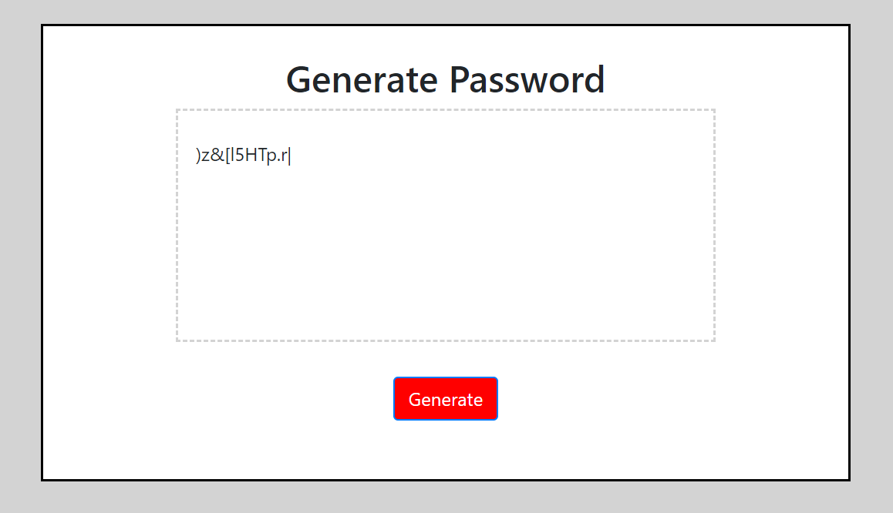

# Password Generator

## About:

An application that generates a random password based on user-selected criteria. This app will run in the browser and feature dynamically updated HTML and CSS powered by your JavaScript code. It will also feature a clean and polished user interface and be responsive, ensuring that it adapts to multiple screen sizes.

## User Story

```
AS AN employee with access to sensitive data
I WANT to randomly generate a password that meets certain criteria
SO THAT I can create a strong password that provides greater security
```




## Technologies Used:

HTML, CSS, and JavaScript

## Deployed Application:

https://joneskm72.github.io/password-generator-hw3/

## Contact:

jones.m.kasey@gmail.com

## License:

MIT